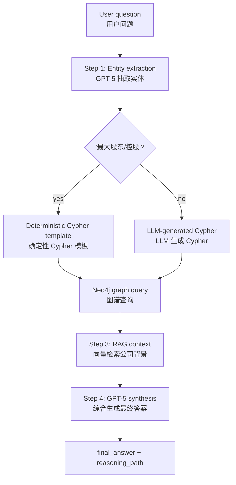
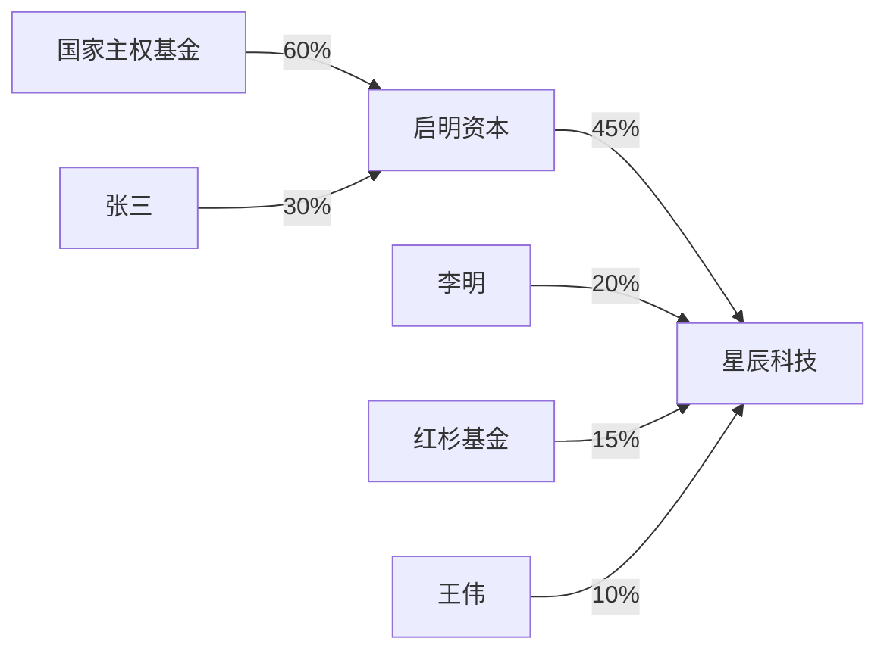

# GraphRAG Multi-hop QA System / 融合文档检索与图谱推理的多跳问答系统

> **Note / 说明.** This assignment uses **OpenAI** (`gpt-5` for the LLM, `text-embedding-3-small` for embeddings) instead of Tongyi Qianwen (DashScope). Only `config.py` changes between backends. The graph layer is **Neo4j** (run via the bundled `docker-compose.yml`); credentials come from `.env` (`NEO4J_URI` / `NEO4J_USERNAME` / `NEO4J_PASSWORD`, defaulting to the compose values). The service listens on **port 8001** so it can run alongside Part 1's `milvus_faq` (port 8000).
>
> 本作业使用 **OpenAI**（LLM 用 `gpt-5`，嵌入用 `text-embedding-3-small`）替代通义千问（DashScope），后端切换只涉及 `config.py`。图谱层为 **Neo4j**（用自带的 `docker-compose.yml` 启动）；凭证来自 `.env`（`NEO4J_URI` / `NEO4J_USERNAME` / `NEO4J_PASSWORD`，默认与 compose 一致）。服务监听 **8001 端口**，以便与 Part 1 的 `milvus_faq`（8000 端口）同时运行。

## 1. Architecture / 架构设计

**EN.** The system answers questions that require both **structured relations** (who owns whom, and how much) and **unstructured text** (company background). A single API endpoint runs a four-step multi-hop pipeline: **entity recognition → graph query (KG) → document retrieval (RAG) → LLM synthesis**, and returns the answer together with a step-by-step `reasoning_path` for explainability. Shareholding relations live in **Neo4j**; company descriptions are indexed by **LlamaIndex** as a vector store; **GPT-5** drives entity extraction, Cypher generation, and the final synthesis.

**中.** 系统回答那些既需要**结构化关系**（谁持有谁、持股多少），又需要**非结构化文本**（公司背景）才能解决的问题。单个 API 端点执行四步多跳流程：**实体识别 → 图谱查询（KG）→ 文档检索（RAG）→ LLM 综合生成**，并连同逐步的 `reasoning_path` 一起返回，实现可解释性。持股关系存于 **Neo4j**；公司简介由 **LlamaIndex** 建成向量索引；**GPT-5** 负责实体抽取、Cypher 生成与最终综合。



## 2. Data & graph model / 数据与图模型

**EN.** Two small datasets seed the system:
- `data/shareholders.csv` — `company_name, shareholder_name, shareholder_type, share_percentage`.
- `data/companies.txt` — free-text profiles of each company.

`graph_builder.py` loads the CSV into Neo4j as a single node label `Entity {name, type}` with a `HOLDS_SHARES_IN {share_percentage}` relationship (`shareholder -> company`). Modelling both companies and shareholders as the same `Entity` label is what makes **multi-hop** natural: a company can itself be a shareholder of another company. In the sample data `启明资本` holds 45% of `星辰科技` **and** is itself 60%-held by `国家主权基金`, enabling 2-hop questions.

**中.** 两份小数据集驱动系统：
- `data/shareholders.csv` —— `company_name, shareholder_name, shareholder_type, share_percentage`。
- `data/companies.txt` —— 各公司的自由文本简介。

`graph_builder.py` 把 CSV 写入 Neo4j，统一用 `Entity {name, type}` 节点标签，并建立 `HOLDS_SHARES_IN {share_percentage}` 关系（`股东 -> 公司`）。把公司与股东建模为同一 `Entity` 标签，正是**多跳**能自然成立的关键：一家公司本身可以是另一家公司的股东。样例数据中，`启明资本` 持有 `星辰科技` 45%，**同时**自身被 `国家主权基金` 持股 60%，从而支持两跳问题。



## 3. Core logic & engineering requirements / 核心逻辑与工程化要求

**EN.**
- **Neo4j equity graph** — `graph_builder.py` builds nodes/relationships with `UNWIND` batch Cypher and an index on `Entity.name`.
- **LlamaIndex document retrieval** — `query_engine.py` builds/loads a persisted `VectorStoreIndex` over `companies.txt` (`similarity_top_k=2`).
- **Multi-hop logic (Cypher + LLM)** — a hybrid strategy: high-frequency, predictable intents ("最大股东"/"控股") use a **deterministic Cypher template** for accuracy; open-ended questions fall back to **LLM-generated Cypher** constrained by an explicit `GRAPH_SCHEMA`. Both execute through the native `neo4j` Python driver (see the APOC note below).
- **Explainable output** — every step appends to `reasoning_path`: the extracted entity, the exact Cypher executed, the raw graph result, the RAG context (truncated), and the synthesis step.
- **Error-propagation guard** — the graph query is wrapped in `try/except`, and the final prompt explicitly tells the LLM to flag empty/contradictory graph results rather than hallucinate, mitigating "wrong edge → wrong answer".
- **No APOC dependency** — we use the native `neo4j` driver instead of LlamaIndex's `Neo4jGraphStore`, because the latter calls `apoc.meta.data` on init and fails on a stock (e.g. Homebrew) Neo4j without the APOC plugin. Our queries are plain Cypher, so the native driver keeps the system portable.

**中.**
- **Neo4j 股权图谱** —— `graph_builder.py` 用 `UNWIND` 批量 Cypher 建立节点/关系，并为 `Entity.name` 建索引。
- **LlamaIndex 文档检索** —— `query_engine.py` 在 `companies.txt` 上构建/加载持久化的 `VectorStoreIndex`（`similarity_top_k=2`）。
- **多跳逻辑（Cypher + LLM 协同）** —— 混合策略：高频、可预测的意图（"最大股东"/"控股"）走**确定性 Cypher 模板**以保证准确；开放性问题则回退到受 `GRAPH_SCHEMA` 约束的 **LLM 生成 Cypher**。两者都通过原生 `neo4j` 驱动执行（见下方 APOC 说明）。
- **可解释性输出** —— 每一步都追加到 `reasoning_path`：抽取的实体、实际执行的 Cypher、图谱原始结果、RAG 上下文（截断）、综合步骤。
- **防错误传播** —— 图谱查询用 `try/except` 包裹，且最终提示词明确要求 LLM 在图谱结果为空/矛盾时如实说明而非臆造，缓解"错误关系 → 错误回答"。
- **不依赖 APOC** —— 我们用原生 `neo4j` 驱动而非 LlamaIndex 的 `Neo4jGraphStore`，因为后者初始化时会调用 `apoc.meta.data`，在未装 APOC 插件的原生 Neo4j（如 Homebrew 安装）上会失败。我们的查询都是纯 Cypher，原生驱动让系统更可移植。

## 4. Actual results (verified) / 实测结果（已验证）

**EN.** Verified end-to-end against a local Neo4j (Homebrew) with GPT-5. Calling `multi_hop_query("星辰科技的最大股东是谁？")` returned:

**中.** 已在本地 Neo4j（Homebrew）+ GPT-5 上端到端验证。调用 `multi_hop_query("星辰科技的最大股东是谁？")` 实际返回：

```text
FINAL ANSWER: 根据提供的知识图谱，星辰科技的最大股东是启明资本，持股45%。

REASONING PATH:
Step 1: Identified the core entity in '星辰科技的最大股东是谁？' -> '星辰科技'
Step 2: Detected the keyword '最大股东/控股'; built a precise Cypher template.
   - Cypher query: MATCH (shareholder:Entity)-[r:HOLDS_SHARES_IN]->(company:Entity {name: '星辰科技'}) RETURN shareholder.name AS shareholder, r.share_percentage AS percentage ORDER BY percentage DESC LIMIT 1
   - Graph result: [{'shareholder': '启明资本', 'percentage': 45.0}]
Step 3: Retrieved background context about '星辰科技' via RAG.
   - RAG context (truncated): 公司名称: 星辰科技 ...
Step 4: The LLM synthesizes the graph result and documents into a final answer.
```

**EN.** The **second hop** was verified too: `multi_hop_query("启明资本的最大股东是谁？持股多少？")` returned *"启明资本的最大股东是国家主权基金，持股60%。"* — so the chain `星辰科技 → 启明资本 (45%) → 国家主权基金 (60%)` is fully traversable across two queries.

**中.** **第二跳**也已验证：`multi_hop_query("启明资本的最大股东是谁？持股多少？")` 返回 *"启明资本的最大股东是国家主权基金，持股60%。"* —— 因此 `星辰科技 → 启明资本 (45%) → 国家主权基金 (60%)` 这条链路可被两次查询完整遍历。

> The exact phrasing of `final_answer` varies because GPT-5 generates it; the `reasoning_path` and graph result are deterministic. / `final_answer` 的具体措辞会因 GPT-5 生成而不同，但 `reasoning_path` 与图谱结果是确定的。

## 5. How to run / 运行方式

```bash
# 1) Start Neo4j (from week03-homework-2/) / 启动 Neo4j
docker compose up -d        # Option A: Docker. Neo4j Browser: http://localhost:7474 (neo4j / password123)
# Option B (no Docker): brew install neo4j && neo4j start, then set the initial password:
#   cypher-shell -u neo4j -p neo4j -d system "ALTER CURRENT USER SET PASSWORD FROM 'neo4j' TO 'password123';"

# 2) Configure .env / 配置 .env (see .env.example)
#    OPENAI_API_KEY=sk-...
#    NEO4J_URI=bolt://localhost:7687
#    NEO4J_USERNAME=neo4j
#    NEO4J_PASSWORD=password123

# 3) Install deps / 安装依赖
uv sync

# 4) Build the graph (once, or after editing the CSV) / 构建图谱
uv run python -m graph_rag.graph_builder

# 5) Start the API / 启动服务
uv run python -m graph_rag.main        # -> http://0.0.0.0:8001 , docs at /docs

# Query / 查询
curl -X POST http://localhost:8001/api/query \
  -H "Content-Type: application/json" \
  -d '{"question": "星辰科技的最大股东是谁？"}'
```

## 6. Key technical analysis / 关键技术点分析

**EN.**
- **Why Neo4j.** "Largest shareholder" needs sorting/filtering over a relationship property (`share_percentage`). Cypher's `ORDER BY ... DESC LIMIT 1` does this in one hop — far cleaner than vector search, which has no notion of ranked relations.
- **Why hybrid Cypher + LLM.** Pure LLM-to-Cypher is flexible but brittle on edge cases; pure templates are accurate but rigid. Routing predictable intents to templates and everything else to schema-constrained LLM Cypher gets the best of both, and the executed Cypher is always surfaced in the reasoning path.
- **Why fuse KG + RAG.** The KG gives the precise fact (who/how much); RAG adds qualitative context (what the company does) so the final answer is both correct and informative.

**中.**
- **为何用 Neo4j。** "最大股东"需要对关系属性（`share_percentage`）排序/筛选。Cypher 的 `ORDER BY ... DESC LIMIT 1` 一跳搞定——远比向量检索干净，后者没有"带权关系排序"的概念。
- **为何用 Cypher + LLM 混合。** 纯 LLM 转 Cypher 灵活但在边界情况脆弱；纯模板准确但僵硬。把可预测意图路由到模板、其余交给受 schema 约束的 LLM Cypher，兼得两者之长，且执行的 Cypher 始终在推理路径中可见。
- **为何融合 KG + RAG。** KG 给出精确事实（谁/多少）；RAG 补充定性背景（公司做什么），使最终答案既正确又有信息量。

## 7. Limitations & improvements / 局限性与改进建议

**EN.**
- **Deeper multi-hop.** Generalise the deterministic path to N hops (e.g. recursive `HOLDS_SHARES_IN*1..3`) instead of relying on the LLM for chained ownership.
- **Entity linking.** Extraction is a single LLM call; fuzzy/aliased names should be resolved against the graph (e.g. full-text or embedding match on `Entity.name`).
- **Cypher safety.** LLM-generated Cypher should be validated/whitelisted (read-only) before execution to prevent destructive queries.
- **Automated graph construction.** Use the LLM to extract entities/relations directly from `companies.txt`, enriching the graph beyond the CSV.
- **Query routing.** Add a router that decides per-question whether KG, RAG, or both are needed, instead of always running both.

**中.**
- **更深的多跳。** 把确定性路径推广到 N 跳（如递归 `HOLDS_SHARES_IN*1..3`），而非依赖 LLM 处理链式控股。
- **实体链接。** 当前抽取是单次 LLM 调用；模糊名/别名应与图谱做消歧（如对 `Entity.name` 做全文或嵌入匹配）。
- **Cypher 安全。** LLM 生成的 Cypher 在执行前应校验/白名单（只读），防止破坏性查询。
- **自动化建图。** 用 LLM 直接从 `companies.txt` 抽取实体/关系，把图谱丰富到超越 CSV。
- **查询路由。** 增加路由器按问题判断需要 KG、RAG 还是两者，而非总是都跑。
