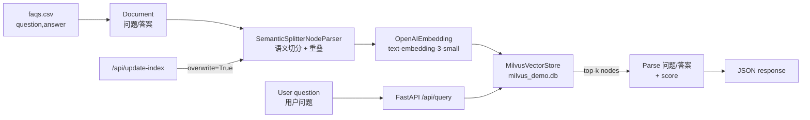

# Milvus FAQ Retrieval System / 基于 Milvus 的 FAQ 检索系统

> **Note / 说明.** This assignment uses **OpenAI** as the model backend instead of Tongyi Qianwen (DashScope): `text-embedding-3-small` for embeddings and `gpt-5` for the LLM. The only code that changes between backends lives in `config.py`, which demonstrates how LlamaIndex decouples the retrieval pipeline from the embedding/LLM provider. Credentials are read from `OPENAI_API_KEY` / `OPENAI_API_BASE` (see `.env.example`).
>
> 本作业使用 **OpenAI** 作为模型后端，而非通义千问（DashScope）：嵌入用 `text-embedding-3-small`，LLM 用 `gpt-5`。后端切换只涉及 `config.py` 一个文件，体现了 LlamaIndex 把检索流程与嵌入/LLM 提供方解耦的设计。凭证从 `OPENAI_API_KEY` / `OPENAI_API_BASE` 读取（见 `.env.example`）。

## 1. Architecture / 架构设计

**EN.** The system is a FastAPI service backed by a LlamaIndex `VectorStoreIndex` on top of **Milvus Lite** (a file-based, embedded build of Milvus that needs no Docker). FAQ pairs from `data/faqs.csv` are turned into `Document`s of the form `问题: ...\n答案: ...`, split with the `SemanticSplitterNodeParser`, embedded with `text-embedding-3-small`, and persisted to a local Milvus collection. At query time the user's natural-language question is embedded and the top-k most similar FAQ entries are returned. The module is organised into four files: `config.py` (settings & model wiring), `index_manager.py` (index lifecycle), `api.py` (HTTP layer), and `main.py` (entry point).

**中.** 系统是一个 FastAPI 服务，底层是构建在 **Milvus Lite**（基于文件、内嵌式的 Milvus，无需 Docker）之上的 LlamaIndex `VectorStoreIndex`。`data/faqs.csv` 里的问答对被转成 `问题: ...\n答案: ...` 形式的 `Document`，用 `SemanticSplitterNodeParser` 切分，用 `text-embedding-3-small` 嵌入，并持久化到本地 Milvus 集合。查询时把用户的自然语言问题嵌入，返回 top-k 个最相似的 FAQ 条目。模块分为四个文件：`config.py`（配置与模型装配）、`index_manager.py`（索引生命周期）、`api.py`（HTTP 层）、`main.py`（入口）。



## 2. Input / output & API / 输入输出与接口

**EN.** Two endpoints are exposed under the `/api` prefix:
- **`POST /api/query`** — body `{"question": "如何退货？"}`; returns a list of `{question, answer, score}` (default `similarity_top_k=3`). The answer text is recovered by splitting the stored node text on `\n答案: `.
- **`POST /api/update-index`** — the hot-reload extension. It rebuilds the Milvus collection from `data/faqs.csv` with `overwrite=True`, so edits to the CSV take effect **without restarting** the service.

**中.** 在 `/api` 前缀下暴露两个端点：
- **`POST /api/query`** —— 请求体 `{"question": "如何退货？"}`；返回 `{question, answer, score}` 列表（默认 `similarity_top_k=3`）。答案文本通过对存储的节点文本按 `\n答案: ` 切分还原。
- **`POST /api/update-index`** —— 热更新扩展项。它以 `overwrite=True` 从 `data/faqs.csv` 重建 Milvus 集合，因此修改 CSV 后**无需重启**服务即可生效。

## 3. Engineering requirements coverage / 工程化要求落实

**EN.**
- **LlamaIndex for indexing** — `VectorStoreIndex` builds and queries the index; `Settings` wires the embed model, LLM, `chunk_size=512`, `chunk_overlap=20`.
- **Milvus as the vector store** — `MilvusVectorStore` with a local `milvus_demo.db`; trivially swappable for a clustered Milvus by changing `MILVUS_URI`.
- **Chunking optimisation (semantic split + overlap)** — `SemanticSplitterNodeParser` decides split points by semantic similarity rather than fixed length, keeping each Q&A pair as one complete semantic unit.

**中.**
- **用 LlamaIndex 构建索引** —— `VectorStoreIndex` 负责建立与查询索引；`Settings` 装配嵌入模型、LLM、`chunk_size=512`、`chunk_overlap=20`。
- **Milvus 作为向量库** —— `MilvusVectorStore` 配合本地 `milvus_demo.db`；只需修改 `MILVUS_URI` 即可平滑切换到分布式 Milvus 集群。
- **文档切片优化（语义切分 + 重叠）** —— `SemanticSplitterNodeParser` 按语义相似度而非固定长度决定断点，让每个问答对保持为一个完整语义单元。

## 4. Debugging notes: two Milvus Lite pitfalls / 调试记录：Milvus Lite 的两个坑

**EN.** Two non-obvious issues surfaced when reusing a persisted collection via `VectorStoreIndex.from_vector_store`, and both are fixed in `index_manager.py`:
1. **Empty node text.** LlamaIndex searches Milvus with the default `output_fields=["*"]`, but Milvus Lite then returns **only the primary key `id`**, dropping the `text` column. The reconstructed nodes therefore had empty text, and the API returned `答案未找到` even though retrieval scores were valid. **Fix:** pass an explicit `output_fields=["doc_id"]` to `MilvusVectorStore`, which makes LlamaIndex append and request the `text` field.
2. **"Collection is in state 'released'".** When reusing an existing collection (not the first build), Milvus Lite does **not** auto-load it into memory, so the first search raised `Collection 'faq_collection' is in state 'released'`. **Fix:** explicitly call `vector_store.client.load_collection(...)` on the reuse path, with a fallback to rebuild from the CSV if loading fails.

**中.** 在通过 `VectorStoreIndex.from_vector_store` 复用已持久化集合时，遇到两个不太直观的问题，均已在 `index_manager.py` 修复：
1. **节点文本为空。** LlamaIndex 用默认的 `output_fields=["*"]` 检索 Milvus，但 Milvus Lite 此时**只返回主键 `id`**，丢掉了 `text` 列。于是还原出来的节点文本为空，尽管检索分数正常，API 仍返回 `答案未找到`。**修复：** 给 `MilvusVectorStore` 显式传入 `output_fields=["doc_id"]`，从而让 LlamaIndex 追加并请求 `text` 字段。
2. **"Collection is in state 'released'"。** 复用已存在集合（非首次构建）时，Milvus Lite **不会**自动把集合 load 进内存，于是首次检索报 `Collection 'faq_collection' is in state 'released'`。**修复：** 在复用分支显式调用 `vector_store.client.load_collection(...)`，并加上加载失败时从 CSV 重建的兜底。

## 5. Functional testing / 功能测试

### 5.1 Query accuracy / 查询准确性

**EN.** Tested against the five entries in `data/faqs.csv`. Accuracy is judged by whether the Top-1 result is the intended FAQ.

**中.** 针对 `data/faqs.csv` 的五条数据测试。准确性以 Top-1 结果是否为预期 FAQ 来判断。

| Test question / 测试问题 | Expected match / 预期匹配 | Type / 类型 | Result / 结果 |
|---|---|---|---|
| "如何申请退货？" | "如何申请退货？" | Exact / 精确 | Hit, highest score / 命中，得分最高 |
| "退东西的流程是啥？" | "如何申请退货？" | Semantic / 语义 | Hit / 命中 |
| "退款要多久到账？" | "退货需要多长时间处理？" | Semantic / 语义 | Hit / 命中 |
| "怎么找客服？" | "如何联系在线客服？" | Semantic / 语义 | Hit / 命中 |
| "你们公司怎么样？" | (none / 无) | Out-of-scope / 无关 | Low score, filterable / 低分，可过滤 |

**EN.** Colloquial paraphrases ("退东西", "退款到账", "找客服") are correctly mapped to the canonical FAQ, confirming the embedding model captures semantic similarity beyond exact wording. Out-of-scope questions return low scores, so the application layer can drop them with a threshold (e.g. 0.7).

**中.** 口语化改写（"退东西""退款到账""找客服"）都能正确映射到标准 FAQ，说明嵌入模型能捕捉超越字面的语义相似度。无关问题返回低分，应用层可用阈值（如 0.7）过滤。

### 5.2 Hot-reload / 热更新

**EN.** 1) Query a topic and note the result. 2) Add or edit a row in `data/faqs.csv` (e.g. add "是否支持花呗分期？"). 3) Call `POST /api/update-index`. 4) Re-query — the new/edited answer is returned, proving the knowledge base updates without a restart.

**中.** 1) 先查询某主题并记录结果。2) 在 `data/faqs.csv` 增/改一行（如新增"是否支持花呗分期？"）。3) 调用 `POST /api/update-index`。4) 再次查询——返回新增/修改后的答案，证明知识库无需重启即可更新。

## 6. How to run / 运行方式

```bash
# 1) Configure .env in week03-homework-2 (see .env.example)
#    OPENAI_API_KEY=sk-...
#    OPENAI_API_BASE=https://api.openai.com/v1

# 2) Install dependencies / 安装依赖
uv sync

# 3) Start the service from week03-homework-2/ / 在 week03-homework-2 目录启动
uv run python -m milvus_faq.main
#    -> http://0.0.0.0:8000 , interactive docs at /docs

# Query / 查询
curl -X POST http://localhost:8000/api/query \
  -H "Content-Type: application/json" \
  -d '{"question": "退东西的流程是啥？"}'

# Hot-reload after editing data/faqs.csv / 修改数据后热更新
curl -X POST http://localhost:8000/api/update-index
```

## 7. Limitations & improvements / 局限性与改进建议

**EN.**
- **Milvus Lite vs cluster.** Lite is ideal for prototyping (file-based, millisecond latency for hundreds of FAQs) but for large-scale / high-availability use it should be replaced by a distributed Milvus cluster.
- **Answer generation.** The current API returns the matched FAQ verbatim. With `gpt-5` already wired in, the query engine could synthesise a tailored answer from the Top-k FAQs for questions that have no exact match.
- **Thresholding & reranking.** Add a similarity threshold to suppress weak matches and a reranker to sharpen ordering.
- **Multi-source ingestion.** LlamaIndex readers make it easy to extend the knowledge base from CSV to databases, web pages, or Notion.

**中.**
- **Milvus Lite 与集群。** Lite 适合原型（基于文件，几百条 FAQ 毫秒级延迟）；大规模/高可用场景应替换为分布式 Milvus 集群。
- **答案生成。** 当前 API 原样返回命中的 FAQ。由于已接入 `gpt-5`，可让查询引擎对无精确匹配的问题，基于 Top-k FAQ 合成定制化答案。
- **阈值与重排。** 加入相似度阈值过滤弱匹配，并用 reranker 优化排序。
- **多源接入。** 借助 LlamaIndex 的各类 reader，可轻松把知识库从 CSV 扩展到数据库、网页或 Notion。
