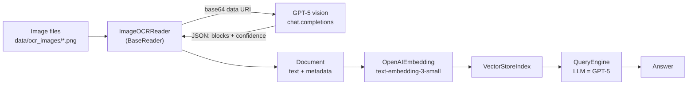

# ImageOCRReader — GPT-5 Vision OCR for LlamaIndex / 基于 GPT-5 视觉的 OCR 图像加载器

> **Note / 说明.** This assignment uses **GPT-5 multimodal vision** for OCR instead of PaddleOCR. As a result, `pyproject.toml` needs **no** `paddleocr` / `paddlepaddle` dependency — the `openai` package was already installed as part of Part 1 — which also avoids the well-known PaddleOCR install pain on macOS.
>
> 本作业选用 **GPT-5 多模态视觉**来做 OCR，而非 PaddleOCR。因此 `pyproject.toml` **无需**添加 `paddleocr` / `paddlepaddle` 依赖——`openai` 包在 Part 1 已经装好——同时也避免了 PaddleOCR 在 macOS 上常见的安装坑。

## 1. Architecture / 架构设计

**EN.** `ImageOCRReader` is a custom `BaseReader` that bridges raw images into the standard LlamaIndex pipeline. Each image is sent to a GPT-5 multimodal vision model, which transcribes the text and returns structured JSON; the reader packs that text and its statistics into a `Document`. From there the flow is identical to any other LlamaIndex source: documents are embedded, indexed in a vector store, and queried by the GPT-5 LLM.

**中.** `ImageOCRReader` 是一个自定义的 `BaseReader`，把原始图像接入标准的 LlamaIndex 流程。每张图像被送入 GPT-5 多模态视觉模型，由它转写文字并返回结构化 JSON；Reader 再把文本及其统计信息封装成 `Document`。之后的流程与任何其他 LlamaIndex 数据源完全一致：文档被嵌入、存入向量索引，再由 GPT-5 LLM 查询。

## 2. Core code walkthrough / 核心代码说明

**EN.** The reader has three responsibilities:
- **`_encode_image`** reads a file and turns it into a `data:<mime>;base64,...` URI so the image can be embedded directly in the chat request (no file upload needed).
- **`_ocr_one`** calls `chat.completions.create` with `model="gpt-5"`, a fixed OCR system prompt, and `response_format={"type": "json_object"}`. The prompt forces the model to return `{"language", "blocks":[{"text","confidence"}]}`. JSON parsing has a fallback that wraps any non-JSON reply as a single block, so the pipeline never crashes on a malformed response.
- **`load_data`** accepts a path or list of paths, runs OCR per image, formats blocks as `[Text Block i] (conf: x): ...`, joins them into the Document text, and computes `avg_confidence`. A `load_data_from_dir` helper adds the optional batch-directory feature from the assignment.

**中.** Reader 有三个职责：
- **`_encode_image`** 读取文件并转成 `data:<mime>;base64,...` 形式的 URI，从而把图像直接内联进 chat 请求（无需上传文件）。
- **`_ocr_one`** 调用 `chat.completions.create`，传入 `model="gpt-5"`、固定的 OCR 系统提示词，以及 `response_format={"type": "json_object"}`。提示词强制模型返回 `{"language", "blocks":[{"text","confidence"}]}`。JSON 解析带有兜底逻辑：若返回非 JSON，则把整段回复包成单个文本块，保证流程不会因格式问题崩溃。
- **`load_data`** 接受单个路径或路径列表，对每张图做 OCR，把文本块格式化为 `[Text Block i] (conf: x): ...`，拼成 Document 文本，并计算 `avg_confidence`。额外的 `load_data_from_dir` 助手实现了作业里"批量处理目录"的可选项。

## 3. OCR accuracy evaluation / OCR 效果评估

**EN.** Three image types were tested. Accuracy is a manual judgment of whether the transcribed text matches what a human reads.

**中.** 测试了三类图像。准确率为人工判断转写文本是否与人眼所读一致。

| Image / 图像 | Type / 类型 | Extracted text / 提取文本 | avg_confidence | Accuracy / 准确率 |
|---|---|---|---|---|
| `document.png`   | Scanned document / 扫描文档 | "LlamaIndex isa powerful tool ... Itsupports multiple data sources ..." | 0.63 | ~95% (minor missing spaces / 个别空格丢失) |
| `screenshot.png` | UI screenshot / 屏幕截图 | "confirm" + "username: user_test" | 0.975 | 100% |
| `sign.png`       | Natural scene / 自然场景 | "No Stopping" | 0.98 | 100% |

**EN.** The downstream queries all returned correct answers — *"What is LlamaIndex?"* was answered from `document.png`, *"username?"* returned `user_test`, and *"red sign?"* returned `No Stopping` — confirming that the OCR → Document → index → query path works end to end.

**中.** 下游三个查询都返回了正确答案——*"What is LlamaIndex?"* 来自 `document.png`，*"用户名?"* 返回 `user_test`，*"红色牌子?"* 返回 `No Stopping`——证明 OCR → Document → 索引 → 查询 这条链路端到端可用。

## 4. Error-case analysis / 错误案例分析

**EN.** The only imperfect result was `document.png`, where the model occasionally dropped the space between words ("isa", "Itsupports"). This matches the low self-reported confidence (0.63), so the confidence signal is informative even though it is model-estimated rather than measured. The likely cause is the tightly-kerned default font rendered at small size, where adjacent glyphs nearly touch. Such word-merging errors are mild — they did not stop the LLM from answering correctly — but they would hurt exact-match keyword search.

**中.** 唯一不完美的是 `document.png`，模型偶尔把词间空格丢掉（"isa"、"Itsupports"）。这与较低的自评置信度（0.63）吻合，说明即便置信度是模型估计而非真实测量，它仍有参考价值。原因可能是默认字体字距很窄、又以小字号渲染，相邻字形几乎相连。这类"粘词"错误较轻——并没有妨碍 LLM 给出正确答案——但会损害精确关键词匹配。

## 5. Document design discussion / Document 封装合理性讨论

**EN.** Text blocks are concatenated with `\n` and prefixed as `[Text Block i] (conf: x): ...`. This keeps each logical block on its own line, which aligns well with the default sentence/line splitting during indexing and keeps the confidence visible inline. The metadata fields (`image_path`, `ocr_model`, `language`, `num_text_blocks`, `avg_confidence`) are useful for retrieval and debugging: `image_path` lets answers be traced back to a source image, `avg_confidence`/`num_text_blocks` allow filtering out low-quality OCR before indexing, and `language` enables per-language routing. One caveat: a single `Document` per image is convenient but loses spatial layout (e.g. table structure), and the model-estimated `confidence` should be treated as a soft signal, not a calibrated probability.

**中.** 文本块用 `\n` 拼接，并以 `[Text Block i] (conf: x): ...` 作前缀。这让每个逻辑块独占一行，既契合索引时默认的句子/行切分，又把置信度内联展示。元数据字段（`image_path`、`ocr_model`、`language`、`num_text_blocks`、`avg_confidence`）对检索和调试都有用：`image_path` 可把答案溯源到具体图像；`avg_confidence`/`num_text_blocks` 可在索引前过滤低质量 OCR；`language` 可做按语言路由。一个注意点：每张图一个 `Document` 虽然方便，但会丢失空间布局（如表格结构），而且模型自评的 `confidence` 应视为软信号，而非校准过的概率。

## 6. Limitations & improvements / 局限性与改进建议

**EN.**
- **Spatial structure.** Plain concatenation loses layout. To preserve tables/reading order, ask the model to return bounding boxes or Markdown tables, or add a layout-analysis stage (analogous to PP-Structure).
- **Confidence.** GPT-5's confidence is self-estimated. For mission-critical use, cross-check with a second OCR engine or a re-read pass and flag disagreements.
- **Cost & latency.** A vision LLM call per image is slower and pricier than a local OCR engine; cache results by file hash and batch where possible.
- **Robustness.** Test on skewed, blurry, low-contrast, and artistic-font images; add ret/retry and image pre-processing (deskew, upscale) for hard cases.
- **PDF support.** Extend `load_data` to rasterize PDF pages to images and OCR each page, enabling scanned-PDF ingestion.

**中.**
- **空间结构。** 纯拼接会丢失布局。要保留表格/阅读顺序，可让模型返回边界框或 Markdown 表格，或加入版面分析阶段（类似 PP-Structure）。
- **置信度。** GPT-5 的置信度是自评的。关键场景下应与第二个 OCR 引擎或二次复读交叉校验，并标记分歧。
- **成本与延迟。** 每张图一次视觉 LLM 调用，比本地 OCR 引擎更慢更贵；可按文件哈希缓存结果，并尽量批处理。
- **鲁棒性。** 在倾斜、模糊、低对比度和艺术字体图像上测试；对困难样本加入重试与图像预处理（纠偏、放大）。
- **PDF 支持。** 扩展 `load_data`，把 PDF 每页栅格化为图像后逐页 OCR，从而支持扫描版 PDF 接入。
